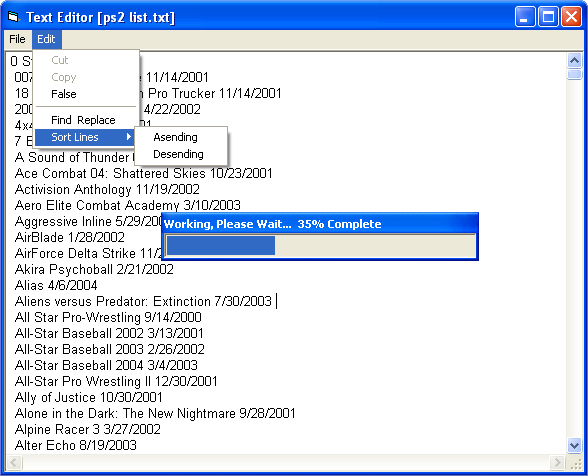



## Advanced Text Editor For Beginers

### Description

This text editor is for beginners. It features, find & replace, basic open and save functions (and detect if the file has been edited) and it is able to sort lines in the loaded file either by ascending or descending order.
 
### More Info
 

             |
---                |---
**Submitted On**   |2004-04-20 02:23:02
**By**             |[Giles Papworth](https://github.com/Planet-Source-Code/PSCIndex/blob/master/ByAuthor/giles-papworth.md)
**Level**          |Beginner
**User Rating**    |4.5 (27 globes from 6 users)
**Compatibility**  |VB 6\.0
**Category**       |[Files/ File Controls/ Input/ Output](https://github.com/Planet-Source-Code/PSCIndex/blob/master/ByCategory/files-file-controls-input-output__1-3.md)
**World**          |[Visual Basic](https://github.com/Planet-Source-Code/PSCIndex/blob/master/ByWorld/visual-basic.md)
**Archive File**   |[Advanced\_T1735564202004\.zip](https://github.com/Planet-Source-Code/giles-papworth-advanced-text-editor-for-beginers__1-53281/archive/master.zip)

